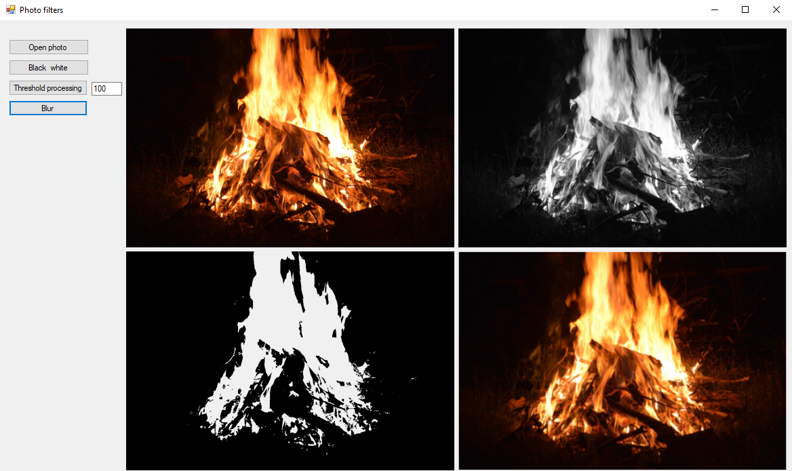

# Photo filters

---

##Project description

This project was written for the purpose of image transformation.  The program allows you to get:
- black-and-white image
- black-and-white image with threshold processing
- blurred image

##Example of execution

##Technologies

C# WinForms

##About the project

- developer: Kaleev Egor
- development date: 2019
- reason for development: computer graphics discipline

 
